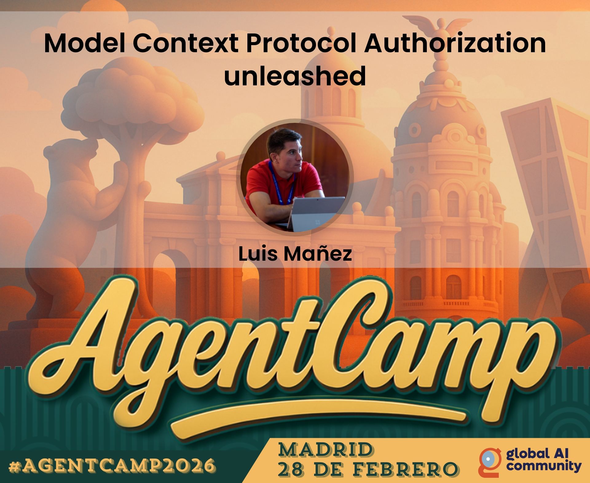

# AgentCamp 2026 - Madrid (aka Global AI Bootcamp)

## Model Context Protocol Authorization unleashed

Seguramente has oído hablar de MCP… puede que incluso hayas visto alguno de los cientos de ejemplos con un TODO MCP Server… pero ¿has visto alguno que hable de authorization?

Únete a esta charla y destriparemos cómo implementar authorization en un MCP Server. Hablaremos de las diferentes opciones y habrá demo de un MCP Server “real-world”, así como de cómo consumirlo desde un cliente usando Microsoft Agent Framework.